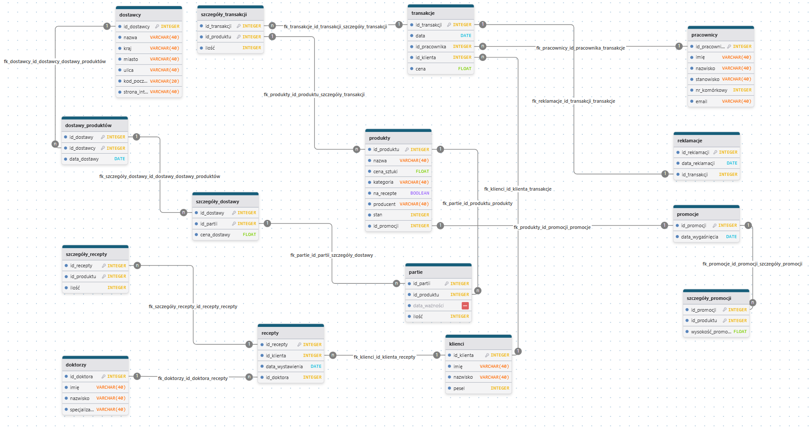

# 
<b>Temat</b>: ApteViTa
  
<b>Autorzy</b>:
- Aleksandra Steczko - 22%
- Konrad Wędzicha - 22%
- Agnieszka Leżoń - 19%
- Dominik Stachura  - 19%
- Kamil Rucki - 18%
#

  

## 1. Zakres i krótki opis systemu

Celem projektu ApteViTa jest stworzenie kompleksowego systemu informatycznego wspierającego zarządzanie apteką. System umożliwia ewidencjonowanie leków, klientów, dostawców oraz sprzedaży, a także obsługę recept i reklamacji. Kluczową funkcją jest automatyzacja procesów sprzedażowych, kontrola stanów magazynowych, realizacja recept oraz generowanie raportów dotyczących sprzedaży. System wspiera pracę farmaceutów, zwiększając efektywność obsługi klienta i minimalizując ryzyko błędów.

  

## 2. Wymagania i funkcje systemu

1. Sprzedaż produktów i generowanie paragonów
2. Automatyczna aktualizacja stanów magazynowych po sprzedaży,
3. Obsługa dodawania, edytowania i usuwania leków
4. Realizacja recept powiązanych z klientem i produktem,
5. Nakładanie promocji i zniżek na produkty
6. Przechowywanie oraz przeszukiwanie historii sprzedaży
7. Prowadzenie bazy klientów, lekarzy, dostawców i doktorów wystawiających recepty
8. Obsługa reklamacji związanych z transakcjami
9. Generowanie raportów sprzedaży i stanów magazynowych
10. Przyjmowanie dostaw nowych produktów

  

## 3. Projekt bazy danych

### Schemat bazy danych
System bazuje na relacyjnym modelu danych, obejmującym kluczowe obszary działalności apteki: sprzedaż, magazyn, dostawy, klientów, lekarzy oraz reklamacje. Schemat przedstawia powiązania pomiędzy tabelami, zapewniając integralność danych i możliwość kompleksowej obsługi procesów aptecznych.

  

  

### Opis poszczególnych tabel

### produkty
Przechowuje informacje o lekach dostępnych w aptece (nazwa, cena za sztukę, kategoria, producent, stan magazynowy, czy wymagają recepty).

| Nazwa        | Typ          | Opis                      |
|-------------|---------------|-------------------------------|
| **id_produktu** | INTEGER | 🔑 PK, not null, unique, autoincrement |
| **nazwa** | VARCHAR(40) | not null |
| **cena_sztuki** | FLOAT | not null |
| **kategoria** | VARCHAR(40) | not null |
| **na_recepte** | BOOLEAN | not null |
| **producent** | VARCHAR(40) | not null |
| **stan** | INTEGER | not null |
| **id_promocji** | INTEGER | nullable |

  

### transakcje
Rejestruje sprzedaż (data, pracownik, klient, wartość transakcji).

| Nazwa        | Typ          | Opis                      |
|-------------|---------------|-------------------------------|
| **id_transakcji** | INTEGER | 🔑 PK, not null, unique, autoincrement |
| **data** | DATE | not null |  |
| **id_pracownika** | INTEGER | not null |
| **id_klienta** | INTEGER | not null |
| **cena** | FLOAT | not null |

  

### szczegóły_transakcji
Zawiera szczegóły dotyczące sprzedanych produktów w ramach danej transakcji (produkt, ilość).

| Nazwa        | Typ          | Opis                      |
|-------------|---------------|-------------------------------|
| **id_transakcji** | INTEGER | 🔑 PK,FK1, not null |
| **id_produktu** | INTEGER | 🔑 PK,FK2, not null |
| **ilość** | INTEGER | not null |

  

### recepty
Rejestruje wystawione recepty, powiązane z klientem i lekarzem oraz datą wystawienia.

| Nazwa        | Typ          | Opis                      |
|-------------|---------------|-------------------------------|
| **id_recepty** | INTEGER | 🔑 PK, not null, unique, autoincrement |
| **id_klienta** | INTEGER | not null |
| **data_wystawienia** | DATE | not null |
| **id_doktora** | INTEGER | not null |

  

### szczegóły_recepty
Określa, jakie produkty i w jakiej ilości znajdują się na danej recepcie.

| Nazwa        | Typ          | Opis                      |
|-------------|---------------|-------------------------------|
| **id_recepty** | INTEGER | 🔑 PK,FK1, not null |
| **id_produktu** | INTEGER | 🔑 PK,FK2, not null |
| **ilość** | INTEGER | not null |

  

### doktorzy
Zawiera dane lekarzy wystawiających recepty (imię, nazwisko, specjalizacja).

| Nazwa        | Typ          | Opis                      |
|-------------|---------------|-------------------------------|
| **id_doktora** | INTEGER | 🔑 PK, not null, unique, autoincrement |
| **imię** | VARCHAR(40) | not null |
| **nazwisko** | VARCHAR(40) | not null |
| **specjalizacja** | VARCHAR(40) | not null |

  

### dostawcy
Przechowuje dane dostawców leków (nazwa, adres, kraj, kontakt).

| Nazwa        | Typ          | Opis                      |
|-------------|---------------|-------------------------------|
| **id_dostawcy** | INTEGER | 🔑 PK, not null |
| **nazwa** | VARCHAR(40) | not null |
| **kraj** | VARCHAR(40) | not null |
| **miasto** | VARCHAR(40) | not null |
| **ulica** | VARCHAR(40) | not null |
| **kod_pocztowy** | VARCHAR(20) | not null |
| **strona_internetowa** | VARCHAR(40) | not null |

  

### dostawy_produktów
Rejestruje informacje o dostawach do apteki (dostawca, data dostawy).

| Nazwa        | Typ          | Opis                      |
|-------------|---------------|-------------------------------|
| **id_dostawy** | INTEGER | 🔑 PK,FK1, not null |
| **id_dostawcy** | INTEGER | 🔑 PK,FK2, not null |
| **data_dostawy** | DATE | not null |

  

### szczegóły_dostawy
Określa, które partie produktów zostały dostarczone w ramach danej dostawy oraz cenę dostawy.

| Nazwa        | Typ          | Opis                      |
|-------------|---------------|-------------------------------|
| **id_dostawy** | INTEGER | 🔑 PK,FK1, not null |
| **id_partii** | INTEGER | 🔑 PK,FK2, not null |
| **cena_dostawy** | FLOAT | not null |

  

### partie
Pozwala na ewidencję poszczególnych partii produktów (data ważności, ilość).

| Nazwa        | Typ          | Opis                      |
|-------------|---------------|-------------------------------|
| **id_partii** | INTEGER | 🔑 PK, not null, unique, autoincrement |
| **id_produktu** | INTEGER | not null |
| **data_ważności** | DATE | not null |
| **ilość** | INTEGER | not null |

  

### pracownicy
Przechowuje dane pracowników apteki (imię, nazwisko, stanowisko, kontakt).

| Nazwa        | Typ          | Opis                      |
|-------------|---------------|-------------------------------|
| **id_pracownika** | INTEGER | 🔑 PK, not null, unique, autoincrement |
| **imię** | VARCHAR(40) | not null |
| **nazwisko** | VARCHAR(40) | not null |
| **stanowisko** | VARCHAR(40) | not null |
| **nr_komórkowy** | INTEGER | not null |
| **email** | VARCHAR(40) | not null |

  

### reklamacje
Umożliwia rejestrację reklamacji dotyczących konkretnych transakcji, w tym datę dokonania reklamacji.

| Nazwa        | Typ          | Opis                      |
|-------------|---------------|-------------------------------|
| **id_reklamacji** | INTEGER | 🔑 PK, not null, unique, autoincrement |
| **data_reklamacji** | DATE | not null |
| **id_transakcji** | INTEGER | not null |

  

### klienci
Zawiera dane osobowe klientów (imię, nazwisko, PESEL).

| Nazwa        | Typ          | Opis                      |
|-------------|---------------|-------------------------------|
| **id_klienta** | INTEGER | 🔑 PK, not null, unique, autoincrement |
| **imię** | VARCHAR(40) | not null |
| **nazwisko** | VARCHAR(40) | not null |
| **pesel** | INTEGER | not null |

  

### promocje
Pozwala na przypisanie zniżek (wyrażonych w % ) do produktów oraz zawiera datę wygaśnięcia promocji.

| Nazwa        | Typ          | Opis                      |
|-------------|---------------|-------------------------------|
| **id_promocji** | INTEGER | 🔑 PK, not null, unique, autoincrement |
| **data_wygaśnięcia** | DATE | not null |

  

### szczegóły_promocji
Określa wielkości zniżki i produkt na który ta zniżka jest nałożona.

| Nazwa        | Typ          | Opis                      |
|-------------|---------------|-------------------------------|
| **id_promocji** | INTEGER | 🔑 PK,FK1, not null |
| **id_produktu** | INTEGER | 🔑 PK,FK2, not null |
| **wysokość_promocji** | FLOAT | not null |
